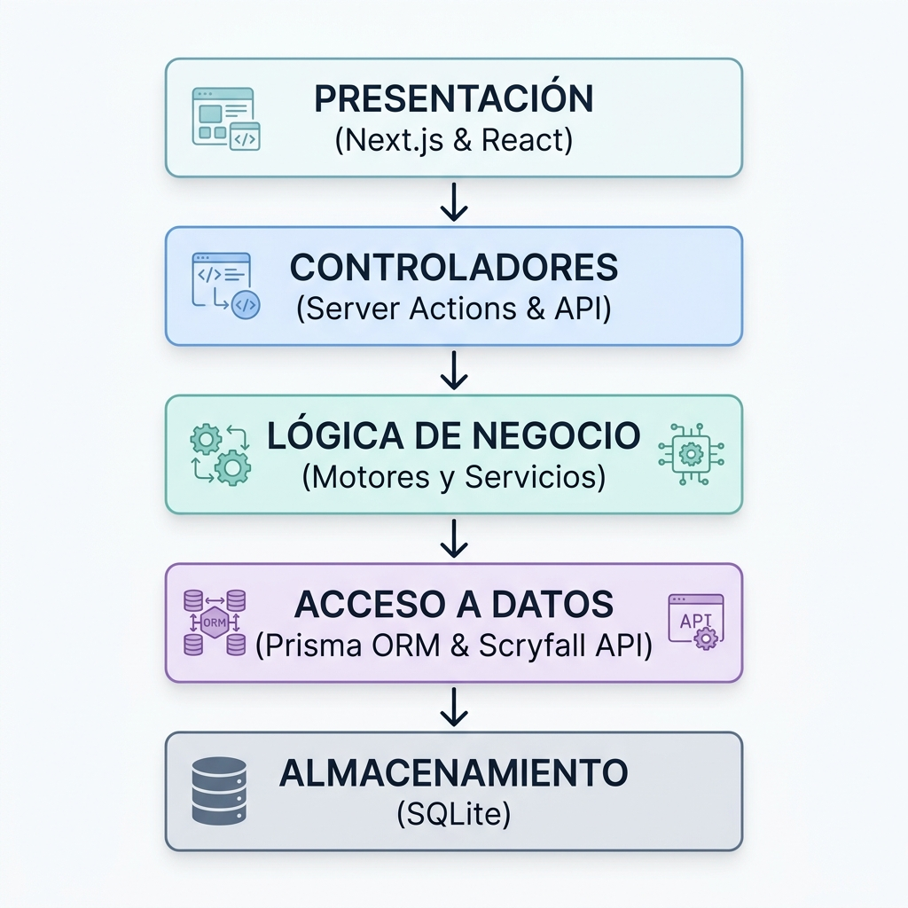
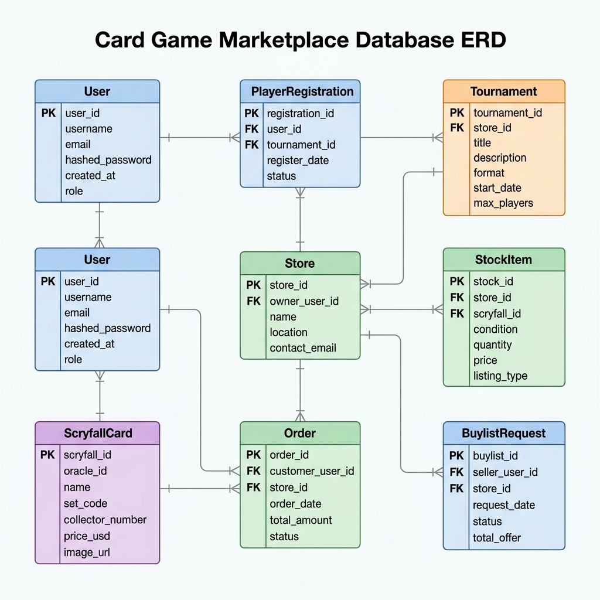
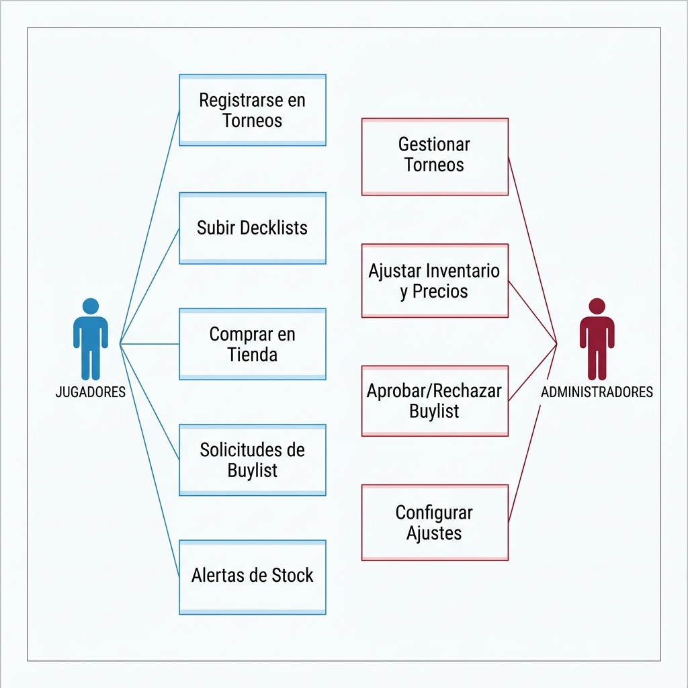

# MTG Manager 🃏🏆

**MTG Manager** es una plataforma web integral diseñada para la administración y automatización de procesos en tiendas locales de juegos de mesa y cartas coleccionables, específicamente enfocada en **Magic: The Gathering**. 

Este proyecto ha sido desarrollado como parte de un **Trabajo Fin de Máster (TFM)**, sirviendo como una solución centralizada que unifica la gestión de torneos, el control inteligente de inventario con integración externa, un sistema de compras/ventas automatizado (*buylist*) y una experiencia interactiva para el jugador.

---

## 📌 Índice de Contenidos
1. [Características Principales](#-características-principales)
2. [Arquitectura y Diseño del Sistema](#-arquitectura-y-diseño-del-sistema)
3. [Catálogo Visual: Vistas del Administrador](#-catálogo-visual-vistas-del-administrador)
4. [Catálogo Visual: Vistas del Jugador](#-catálogo-visual-vistas-del-jugador)
5. [Tecnologías Utilizadas](#-tecnologías-utilizadas)
6. [Instalación y Configuración](#-instalación-y-configuración)

---

## 🚀 Características Principales

### 1. Gestión de Torneos y Eventos
*   **Emparejamientos Automáticos:** Implementación del formato de torneo Suizo y eliminatorias directas.
*   **Cálculo de Desempates Oficiales:** Motor interno de clasificación que aplica desempates competitivos homologados de MTG:
    *   *Opponent Match Win Percentage (OMW%)*
    *   *Game Win Percentage (GW%)*
    *   *Opponent Game Win Percentage (OGW%)*
*   **Misiones y Logros:** Definición de retos específicos durante el torneo que otorgan puntos adicionales a los jugadores para incentivar la participación recreativa.

### 2. Control de Inventario y Precios Dinámicos
*   **Sincronización con Scryfall API:** Importación masiva e individualizada de cartas del catálogo oficial de Magic.
*   **Pricing Engine Automatizado:** Ajuste dinámico de precios de venta en función del estado de conservación de la carta (*Condition Modifiers*) y reglas de margen y redondeo programables (*Rounding Bands*).
*   **Alertas de Stock y Fluctuaciones:** Alertas automáticas para notificar a los administradores variaciones críticas en precios de mercado o escasez de existencias demandadas por los jugadores.

### 3. Canal de Compra a Usuarios (*Buylist*)
*   **Tasaciones Automatizadas:** Cotización en tiempo real para las cartas que los jugadores quieren vender a la tienda física.
*   **Precios por Tramos (*Buylist Price Bands*):** Configuración flexible que aplica márgenes de pago en efectivo (*Cash*) o crédito de tienda (*Store Credit*) diferenciados según el valor unitario de la carta.

### 4. E-Commerce y Fidelización de Usuarios
*   **Carrito de Compras y Pedidos:** Proceso simplificado de compra de singles.
*   **Venta Flash:** Creación de promociones temporales para liquidar stock de cartas específicas.
*   **Monedero Virtual:** Uso de Crédito de Tienda acumulado para pagar inscripciones a torneos o compras de cartas.

---

## 📐 Arquitectura y Diseño del Sistema

El software se diseñó bajo una arquitectura modular limpia en capas para desacoplar el almacenamiento, el negocio y la presentación, garantizando una alta mantenibilidad de la aplicación.

### A. Capas de la Aplicación
El flujo de datos se procesa de forma segura a través de Server Actions como controladores e interactúa con motores de negocio aislados en TypeScript.



### B. Diagrama Entidad-Relación (ERD)
Representación detallada de la base de datos relacional que soporta la persistencia transaccional del sistema:



### C. Mapa de Casos de Uso
Interacciones principales del sistema divididas por los roles del Administrador (Tendero) y el Jugador (Cliente):



---

## 💼 Catálogo Visual: Vistas del Administrador

La interfaz administrativa proporciona a los dueños de tiendas un control absoluto sobre el estado del negocio, torneos en curso y la gestión del catálogo.

### 1. Panel de Administración (Dashboard)
Resumen general del estado de la tienda, con gráficas de transacciones, historial de precios, últimos pedidos y control rápido del sistema.


### 2. Gestión de Inventario de Singles
Catálogo de las cartas físicas en stock. Permite ver el acabado (Foil/Normal), condición, idioma, cantidad disponible y ajustar manualmente precios individuales o vincularlos a reglas automáticas.


### 3. Tasaciones y Solicitudes de Buylist
Bandeja de entrada para revisar las ofertas de cartas que los jugadores envían a la tienda. Permite validar el estado real de la carta y procesar el pago en efectivo o crédito directamente en el monedero del jugador.


### 4. Control de Torneos y Emparejamientos
Gestión de torneos en tiempo real. Los administradores controlan las mesas asignadas, registran los resultados de las rondas, ejecutan los emparejamientos dinámicos de la siguiente ronda y otorgan los premios finales.


### 5. Redacción de Artículos y Novedades
Gestor de contenido (CMS) para que la tienda publique noticias, guías de barajas, eventos futuros e información de interés para la comunidad de jugadores.


---

## 👥 Catálogo Visual: Vistas del Jugador

El portal del jugador está optimizado para su uso en dispositivos móviles y de escritorio, permitiéndoles participar en torneos y realizar transacciones de forma ágil.

### 1. Compra de Singles (E-Commerce)
Buscador avanzado y listado de cartas individuales de Magic disponibles para la compra en la tienda. Incluye filtrado por colores, rarezas, expansiones e idiomas, con un sistema de carrito integrado.


### 2. Venta de Singles (Buylist)
Formulario interactivo para buscar cartas de la base de datos oficial y añadirlas a una solicitud de venta a la tienda. Muestra inmediatamente la cotización estimada de pago en metálico frente al incentivo de crédito de tienda.


### 3. Configuración de Alertas de Stock
Los jugadores pueden registrar alertas para cartas que actualmente están agotadas. El sistema les notificará automáticamente tan pronto como la tienda adquiera y agregue stock de dicho artículo.


### 4. Perfil Personal y Crédito de Tienda
Espacio del usuario donde visualiza su historial de compras, ventas enviadas y puede ver su saldo en crédito de tienda acumulado a través de premios y buylists.


### 5. Torneos y Emparejamientos Activos
Vista interactiva del torneo en el que participa el jugador. Muestra su mesa asignada en la ronda actual, la clasificación provisional y los emparejamientos en tiempo real.


### 6. Blog y Artículos Informativos
Feed de artículos publicados por la tienda, permitiendo a los jugadores leer análisis de cartas, reportajes de torneos y novedades locales.


---

## 🛠️ Tecnologías Utilizadas

El desarrollo del proyecto se apoya en tecnologías modernas del ecosistema React/Node:

*   **Framework principal:** [Next.js 15 (App Router)](https://nextjs.org/) con soporte completo para Server Components y Server Actions.
*   **Lenguaje:** [TypeScript](https://www.typescriptlang.org/) para tipado estático y robustez del código.
*   **Base de datos y ORM:** [Prisma ORM](https://www.prisma.io/) interactuando con un motor relacional [SQLite](https://sqlite.org/) (configurable a PostgreSQL para producción).
*   **Diseño y Maquetación:** [Tailwind CSS](https://tailwindcss.com/) junto con componentes interactivos estilizados y responsive.
*   **Consumo de APIs:** Integración nativa con la API pública de [Scryfall](https://scryfall.com/docs/api).

---

## 📥 Instalación y Configuración

Si deseas ejecutar el proyecto localmente para desarrollo:

1.  **Clonar el repositorio:**
    ```bash
    git clone https://github.com/tu-usuario/mtg-manager.git
    cd mtg-manager
    ```

2.  **Instalar dependencias:**
    ```bash
    npm install
    ```

3.  **Configurar variables de entorno:**
    Crea un archivo `.env` en la raíz del proyecto y define tus claves básicas:
    ```env
    DATABASE_URL="file:./dev.db"
    NEXTAUTH_SECRET="tu_secreto_para_sesiones"
    ```

4.  **Inicializar la Base de Datos con Prisma:**
    ```bash
    npx prisma migrate dev --name init
    npx prisma db seed
    ```

5.  **Iniciar el servidor de desarrollo:**
    ```bash
    npm run dev
    ```
    La aplicación estará disponible en [http://localhost:3000](http://localhost:3000).

