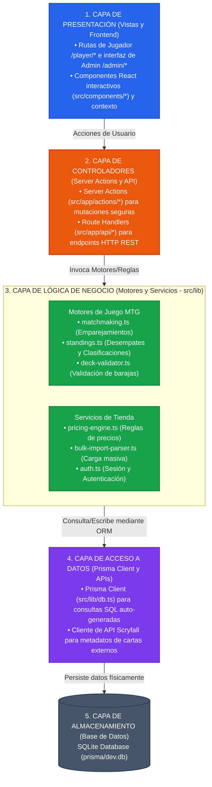

# Capas de Arquitectura - MTG Manager

Este documento describe las capas de arquitectura de la aplicación **MTG Manager**. Al tratarse de un proyecto desarrollado en **Next.js (App Router)** con **Prisma ORM**, la arquitectura sigue un modelo híbrido cliente-servidor moderno que distribuye la lógica entre componentes frontend reactivos, Server Actions como controladores y módulos de lógica de negocio aislados en el backend.

---

## 1. Diagrama de Capas de la Aplicación

El siguiente diagrama detalla la jerarquía de las capas de software, sus dependencias y el flujo de los datos desde la interfaz de usuario hasta la base de datos:

---

## 2. Descripción Detallada de Capas

### A. Capa de Presentación (Frontend)
Situada en la parte superior, gestiona lo que el usuario ve e interactúa.
*   **Next.js App Router (`src/app`)**: Organiza las vistas mediante carpetas físicas (`/admin` y `/player`).
*   **React Server Components (RSC)**: Componentes que se renderizan por defecto en el servidor. Obtienen datos de manera eficiente al estar físicamente más cerca del backend, eliminando llamadas de red innecesarias en el inicio.
*   **React Client Components (RCC)**: Componentes interactivos que requieren interacción en tiempo real del navegador (estados locales, clics, modales, etc.). Se declaran mediante `"use client"`.
*   **React Context (`CartContext`)**: Mantiene el estado global del carrito de compras del usuario mientras navega por la interfaz de venta de singles.

### B. Capa de Controladores (Server Actions y API Routes)
Funciona como el puente seguro entre el navegador y los servicios del servidor.
*   **Server Actions (`src/app/actions`)**: Funciones asíncronas seguras que se ejecutan exclusivamente en el servidor (declaradas con `"use server"`). Capturan peticiones de mutación del cliente, gestionan revalidaciones de página y controlan el flujo de peticiones.
*   **Route Handlers (`src/app/api`)**: Endpoints HTTP REST estándar. Se utilizan principalmente para operaciones asíncronas de integración y consultas de datos donde se necesita interoperar por HTTP clásico en lugar de Server Actions directas.

### C. Capa de Lógica de Negocio / Servicios (`src/lib`)
Esta capa es el núcleo funcional de la aplicación. Contiene algoritmos complejos y reglas del juego específicas de Magic: The Gathering y la gestión de la tienda física:
*   **Validador de Barajas (`deck-validator.ts`)**: Valida que las barajas cargadas por los jugadores sigan las reglas de legalidad del formato configurado (tamaño mínimo, límites de copias de cartas, cartas prohibidas, etc.).
*   **Emparejamiento (`matchmaking.ts`)**: Implementa algoritmos de emparejamiento para torneos suizos y eliminatorias directas.
*   **Clasificaciones (`standings.ts`)**: Calcula las tablas de puntuaciones del torneo aplicando reglas oficiales de desempate (porcentaje de victorias del oponente, porcentaje de victorias del juego, etc.).
*   **Motor de Precios Dinámicos (`pricing-engine.ts`)**: Calcula los precios de venta de las cartas físicas combinando datos de mercado actualizados en tiempo real y reglas aplicadas por los tenderos (multiplicadores de condición, bandas de redondeo, etc.).
*   **Servicio de Autenticación (`auth.ts`)**: Gobierna las políticas de inicio de sesión, sesiones activas y control de roles (`PLAYER` o `ADMIN`).

### D. Capa de Persistencia e Integración
Resuelve cómo los datos se guardan y se sincronizan con servicios externos.
*   **Prisma ORM Client (`src/lib/db.ts`)**: Cliente auto-generado tipado basado en `prisma/schema.prisma`. Traduce las consultas del backend a sentencias SQL legibles y optimizadas.
*   **Scryfall API Client**: Módulo HTTP que consume los servicios REST públicos de Scryfall para buscar cartas y descargar metadatos que luego son persistidos localmente.

### E. Capa de Base de Datos
*   **SQLite (`prisma/dev.db`)**: Motor de base de datos relacional ligero, rápido y autocontenido. Ideal para entornos locales de desarrollo, guardando de forma robusta la consistencia transaccional del sistema.

---

## 3. Flujo de Datos Típico (Ejemplo de Registro a Torneo)

Para ilustrar cómo se comunican estas capas, a continuación se detalla el ciclo completo de una solicitud de registro de jugador:

1.  **Capa de Presentación**: Un jugador hace clic en "Registrarse en Torneo" en la página `/player/tournaments`.
2.  **Capa de Controladores**: El botón ejecuta una Server Action (`registerForTournament` en `src/app/actions/tournament-actions.ts`), enviando el `tournamentId` y el `userId` encriptado de la sesión.
3.  **Capa de Lógica de Negocio**: La acción valida que el torneo acepte registros y comprueba el saldo del jugador (`storeCredit`).
4.  **Capa de Persistencia**: Si la validación es exitosa, se invoca a Prisma Client (`db.playerRegistration.create(...)`).
5.  **Capa de Base de Datos**: SQLite procesa la transacción y guarda la fila.
6.  **Retorno y Actualización**: El servidor revalida la ruta actual (`revalidatePath`), lo que obliga a la **Capa de Presentación** a re-renderizar los Server Components de la página para reflejar el estado "Registrado".
