# Diagrama Entidad-Relación - MTG Manager

Este documento presenta el diagrama entidad-relación (ERD) actualizado para el sistema **MTG Manager**. La estructura está basada en el archivo de esquema de Prisma actual ([schema.prisma](file:///c:/Users/jorge/.gemini/antigravity/scratch/mtg-manager/prisma/schema.prisma)) y se organiza en módulos lógicos para facilitar su comprensión.

---

## 1. Diagrama de Relaciones (Mermaid)

El siguiente diagrama muestra las entidades y cómo se relacionan entre sí. Puedes interactuar con él si tu visualizador de Markdown soporta Mermaid:

```mermaid
erDiagram
    %% ==========================================
    %% ENTIDADES Y CLAVES
    %% ==========================================
    User {
        string id PK
        string name
        string email UK
        string role
        float storeCredit
    }
    Store {
        string id PK
        string name
        string ownerId FK
    }
    Tournament {
        string id PK
        string name
        string format
        string status
        string storeId FK
    }
    PlayerRegistration {
        string id PK
        string tournamentId FK
        string userId FK
        string deckUrl
        boolean isPaid
        int score
    }
    Match {
        string id PK
        string tournamentId FK
        int roundNumber
        int tableNumber
        string status
    }
    MatchPlayer {
        string id PK
        string matchId FK
        string registrationId FK
        int points
    }
    TournamentPrize {
        string id PK
        string tournamentId FK
        string name
        int startPlace
        int endPlace
        float storeCreditAmount
    }
    TournamentMission {
        string id PK
        string tournamentId FK
        string description
        int points
    }
    UserPrize {
        string id PK
        string userId FK
        string tournamentId FK
        string name
        int place
    }
    ScryfallCard {
        string id PK
        string oracleId
        string name
        string setCode
        float priceEur
        float priceUsd
    }
    StockItem {
        string id PK
        string scryfallCardId FK
        string condition
        string finish
        int quantity
        float salePrice
        string pricingRuleId FK
    }
    ConditionModifier {
        string id PK
        string condition UK
        float multiplier
    }
    FlashSale {
        string id PK
        string name
        float discount
        datetime startsAt
        datetime expiresAt
        boolean isActive
    }
    FlashSaleItem {
        string id PK
        string flashSaleId FK
        string stockItemId FK
    }
    RoundingBand {
        string id PK
        float minPrice
        float maxPrice
        float roundTo
        int priority
    }
    PricingRule {
        string id PK
        string name
        string type
        float valueA
    }
    PriceHistory {
        string id PK
        string scryfallCardId FK
        float priceEur
        datetime recordedAt
    }
    SyncLog {
        string id PK
        string type
        string status
        int cardsUpserted
    }
    Cart {
        string id PK
        string userId FK
    }
    CartItem {
        string id PK
        string cartId FK
        string stockItemId FK
        int quantity
    }
    Order {
        string id PK
        string userId FK
        string status
        float totalPrice
    }
    OrderItem {
        string id PK
        string orderId FK
        string stockItemId FK
        int quantity
    }
    Notification {
        string id PK
        string userId FK
        string title
        boolean read
    }
    StockNotification {
        string id PK
        string userId FK
        string oracleId
        boolean isFulfilled
    }
    PriceAlert {
        string id PK
        string scryfallCardId FK
        string storeId FK
        float oldPrice
        float newPrice
    }
    Article {
        string id PK
        string title
        string tags
    }
    BuylistRequest {
        string id PK
        string userId FK
        string status
        float totalPrice
        string tradeType
    }
    BuylistItem {
        string id PK
        string buylistRequestId FK
        string scryfallCardId FK
        int quantity
        float marketPrice
        float buyPrice
    }
    BuylistPriceBand {
        string id PK
        float minPrice
        float maxPrice
        float rateCash
        float rateCredit
    }

    %% ==========================================
    %% RELACIONES
    %% ==========================================
    User ||--o{ PlayerRegistration : registers
    User ||--o{ Store : owns
    User ||--o{ UserPrize : receives
    User ||--o| Cart : has
    User ||--o{ Order : places
    User ||--o{ Notification : receives
    User ||--o{ StockNotification : requests
    User ||--o{ BuylistRequest : requests

    Store ||--o{ Tournament : hosts
    Store ||--o{ PriceAlert : triggers

    Tournament ||--o{ PlayerRegistration : registers
    Tournament ||--o{ Match : has
    Tournament ||--o{ TournamentMission : defines
    Tournament ||--o{ TournamentPrize : defines
    Tournament ||--o{ UserPrize : awards

    PlayerRegistration ||--o{ MatchPlayer : plays

    Match ||--o{ MatchPlayer : includes

    ScryfallCard ||--o{ StockItem : instantiates
    ScryfallCard ||--o{ PriceAlert : has
    ScryfallCard ||--o{ BuylistItem : is_listed_in

    PricingRule ||--o{ StockItem : applies_to
    StockItem ||--o{ CartItem : in_cart
    StockItem ||--o{ OrderItem : ordered
    StockItem ||--o{ FlashSaleItem : in_sale

    FlashSale ||--o{ FlashSaleItem : contains

    Cart ||--o{ CartItem : contains

    Order ||--o{ OrderItem : contains

    BuylistRequest ||--o{ BuylistItem : contains
```

---

## 2. Descripción de Módulos y Entidades

El esquema se divide en 5 módulos funcionales principales:

### A. Módulo de Usuarios y Tiendas (Users & Stores)
Gestiona la autenticación, roles de usuario, notificaciones y la configuración de las tiendas físicas.

*   **User**: Representa a un usuario del sistema (jugadores, tenderos y administradores). Contiene saldos (`storeCredit`) y relaciones con compras, torneos y carritos.
*   **Store**: Tienda física propietaria de torneos e inventario. Define los umbrales de alerta de precios (`priceAlertDailyThreshold`, `priceAlertWeeklyThreshold`) y tasas de buylist por defecto.
*   **Notification**: Mensajes del sistema dirigidos a un usuario.
*   **StockNotification**: Avisos de disponibilidad de cartas basados en un `oracleId` de Scryfall.

### B. Módulo de Torneos y Eventos (Tournaments)
Gestiona la organización de torneos Magic: The Gathering (emparejamientos, rondas, puntuaciones y premios).

*   **Tournament**: Define el evento (formato, estado de rondas, tipo de emparejamiento, etc.). Pertenece a una `Store`.
*   **PlayerRegistration**: Registro y participación de un usuario en un torneo. Controla si ha pagado, su baraja (`deckUrl`, `deckCost`), puntuación y si ha abandonado (`drop`).
*   **Match**: Enfrentamiento específico dentro de una ronda y mesa de un torneo.
*   **MatchPlayer**: Entrada asociativa entre un enfrentamiento (`Match`) y un participante (`PlayerRegistration`). Guarda los puntos de ronda y misiones completadas.
*   **TournamentMission**: Misiones secundarias o logros específicos definidos para un torneo que otorgan puntos adicionales.
*   **TournamentPrize**: Estructura de premios configurada para el torneo por rangos de posición final.
*   **UserPrize**: Registro histórico del premio otorgado a un usuario por participar o ganar en un torneo.

### C. Módulo de Catálogo e Inventario (Catalog & Inventory)
Sincroniza y gestiona las cartas físicas disponibles para la venta o compra, basándose en la base de datos de Scryfall.

*   **ScryfallCard**: Catálogo de cartas maestras importadas de Scryfall. Almacena metadatos (nombre, set, coste de maná, colores, legalidades, precios referenciales de mercado).
*   **StockItem**: Inventario físico real de la tienda. Modula estado (`finish`), idioma, condición de la carta (NM, LP, MP, HP, PO), cantidad y precio de venta. Se vincula a reglas de precios automáticas.
*   **PricingRule**: Reglas dinámicas de ajuste de precios que pueden asignarse a múltiples `StockItem`.
*   **PriceHistory**: Historial cronológico de precios de Eur/Foil para monitorizar cambios y tendencias.
*   **ConditionModifier**: Multiplicadores de precio según el estado de conservación de la carta (NM, LP, etc.).
*   **RoundingBand**: Rangos de precios para configurar reglas de redondeo automáticas según su prioridad.
*   **SyncLog**: Registro de sincronización con la API externa de Scryfall.

### D. Módulo de Ventas, Carrito y Ofertas (Sales & Store)
Gobierna el flujo de compra de cartas a través del e-commerce de la tienda.

*   **Cart**: Carrito de compras asociado a un usuario (relación 1 a 1).
*   **CartItem**: Elementos y cantidades reservados temporalmente en el carrito.
*   **Order**: Pedido definitivo realizado por un usuario.
*   **OrderItem**: Línea de detalle de un pedido que asocia el `StockItem` vendido con su precio en el momento exacto de la compra.
*   **FlashSale**: Promoción temporal por porcentaje de descuento.
*   **FlashSaleItem**: Asociación de un artículo de inventario (`StockItem`) a una oferta flash activa.
*   **PriceAlert**: Registro de fluctuaciones significativas de precios para avisar a las tiendas.
*   **Article**: Artículos informativos y publicaciones del blog de la tienda.

### E. Módulo de Compras a Usuarios (Buylist)
Permite a los usuarios vender sus cartas a la tienda a cambio de efectivo o saldo de tienda.

*   **BuylistRequest**: Solicitud de venta de cartas enviada por un usuario. Contiene el total ofertado y el método de pago seleccionado (`CASH` o `STORE_CREDIT`).
*   **BuylistItem**: Detalles de las cartas que el usuario desea vender (idioma, acabado, condición, precio de mercado y precio que la tienda ofrece pagar).
*   **BuylistPriceBand**: Configuración de márgenes y tasas aplicables de compra según los rangos de precio de mercado.

---

## 3. Claves Únicas e Índices Importantes

Para garantizar el rendimiento y la integridad de los datos, el esquema implementa las siguientes restricciones y optimizaciones:

1.  **PlayerRegistration**: Clave única compuesta en `[tournamentId, userId]`. Evita que un jugador se registre dos veces en el mismo torneo.
2.  **StockItem**: Clave única compuesta en `[scryfallCardId, condition, finish, language]`. Asegura que el stock de una carta específica con las mismas propiedades físicas se agrupe en una sola fila.
3.  **FlashSaleItem**: Clave única compuesta en `[flashSaleId, stockItemId]`. Evita duplicidad de un producto en la misma venta flash.
4.  **CartItem**: Clave única compuesta en `[cartId, stockItemId]`.
5.  **Índices de Búsqueda (ScryfallCard)**:
    *   `@@index([name])` - Para autocompletar búsquedas de cartas rápidamente.
    *   `@@index([setCode])` - Para filtrar por expansiones.
    *   `@@index([oracleId])` - Para relacionar versiones o variantes de una misma carta.
6.  **Índices Históricos (PriceHistory)**:
    *   `@@index([scryfallCardId, recordedAt])` - Para consultas de gráficas de precios en el tiempo.
