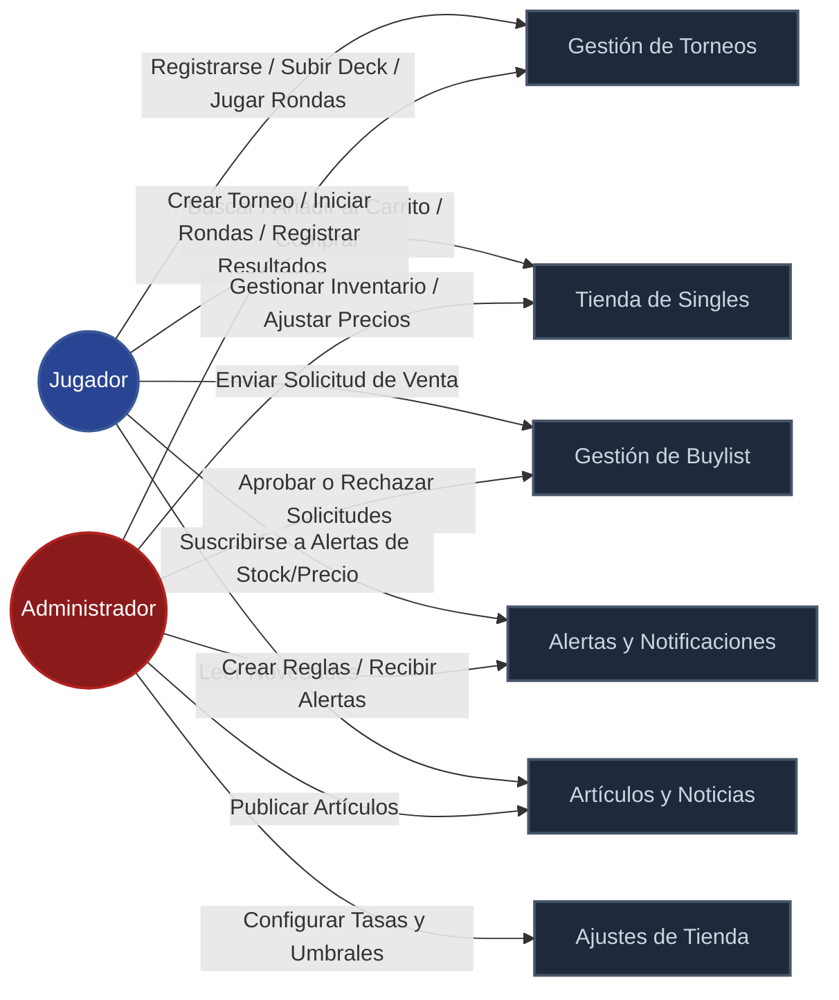
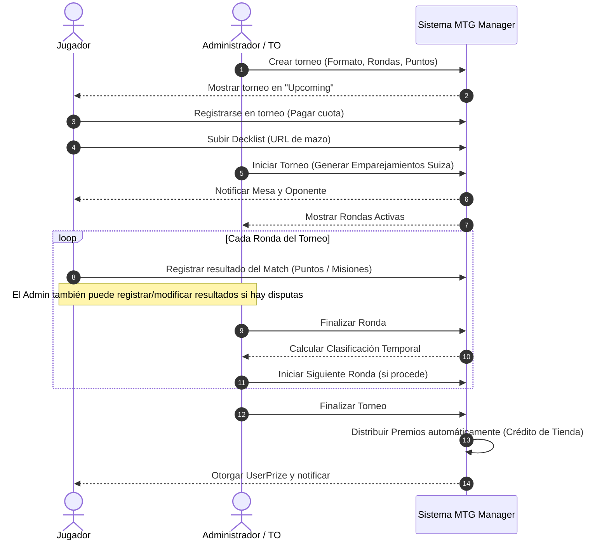
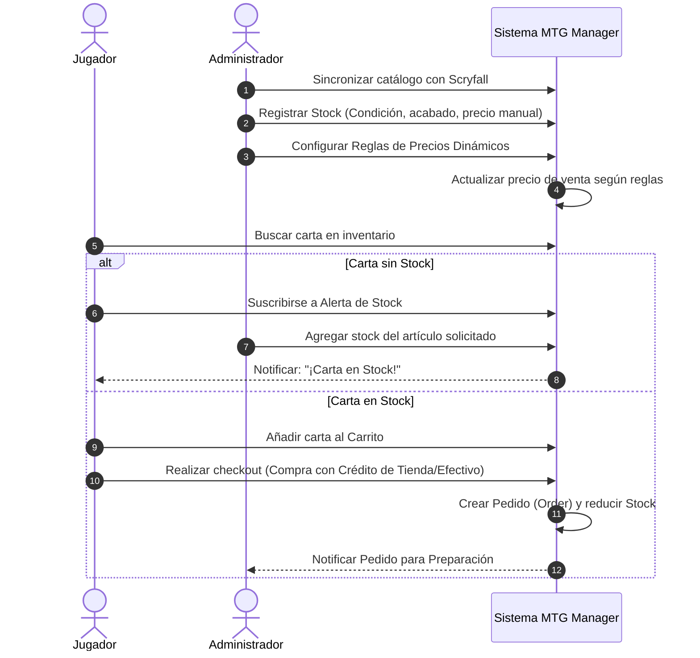
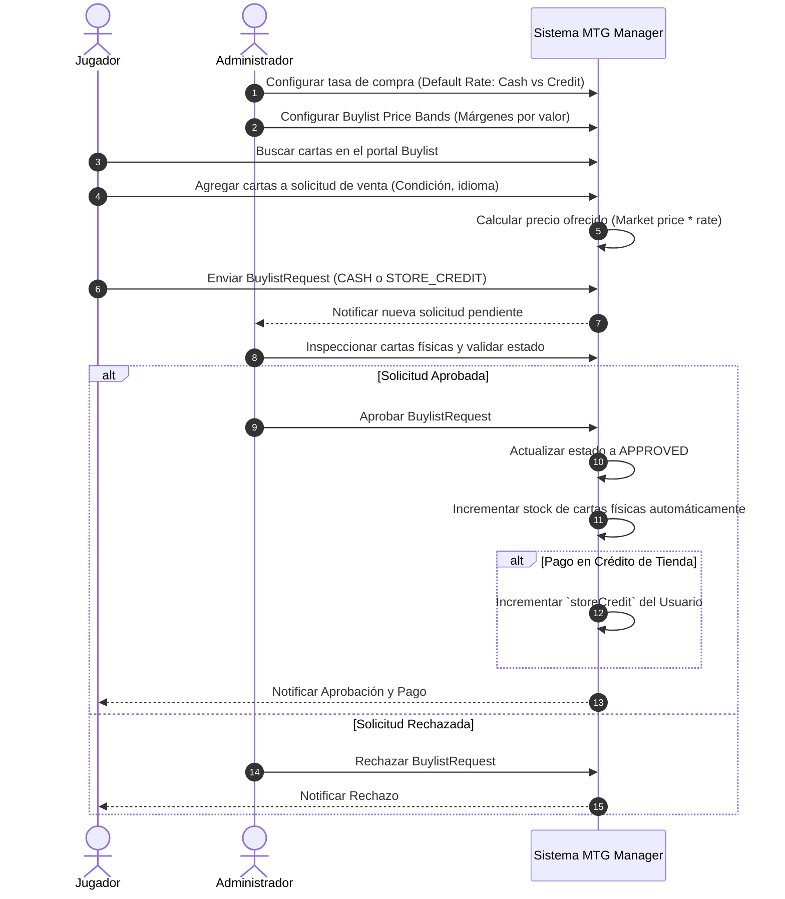

# Diagrama de Interacción - MTG Manager

Este documento detalla la interacción entre los usuarios (Jugadores), los administradores de la tienda y las diferentes funcionalidades del sistema **MTG Manager**. Al igual que el ERD, se estructura de manera visual y descriptiva basándose en el diseño de rutas del proyecto ([src/app](file:///c:/Users/jorge/.gemini/antigravity/scratch/mtg-manager/src/app)) y componentes ([src/components](file:///c:/Users/jorge/.gemini/antigravity/scratch/mtg-manager/src/components)).

---

## 1. Mapa General de Casos de Uso

El siguiente mapa muestra a qué módulos y funcionalidades tiene acceso cada actor del sistema:

---

## 2. Diagramas de Secuencia (Flujos de Interacción)

### A. Flujo del Ciclo de Vida de un Torneo
Muestra el proceso desde que el Administrador publica un evento hasta que el Jugador finaliza las rondas y recibe premios.

### B. Flujo de Compra de Singles y Alertas de Stock
Interacción con el catálogo e-commerce e inventario físico.

### C. Flujo de Buylist (Venta de cartas a la tienda)
Proceso por el cual los jugadores venden su material sobrante y obtienen crédito o efectivo.

---

## 3. Matriz de Roles y Permisos (RBAC)

El sistema opera bajo dos roles primarios definidos en la base de datos (`PLAYER` y `STORE_OWNER` / `ADMIN`). Sus accesos y capacidades se distribuyen de la siguiente manera:

| Funcionalidad / Acción | Jugador (PLAYER) | Administrador (ADMIN) |
| :--- | :---: | :---: |
| **Torneos** | | |
| Registrarse y pagar | Sí | - |
| Subir/actualizar Decklist | Sí | - |
| Reportar resultados de ronda propia | Sí | Sí |
| Modificar resultados ajenos o forzar rondas | No | Sí |
| Crear y parametrizar torneos | No | Sí |
| **Catálogo e Inventario** | | |
| Buscar cartas y ver gráficos de precios | Sí | Sí |
| Modificar stock físico (cantidades/precios) | No | Sí |
| Configurar reglas de precios automáticas | No | Sí |
| Sincronizar catálogo con Scryfall | No | Sí |
| **Compras (E-Commerce)** | | |
| Añadir al carrito y finalizar pedido | Sí | - |
| Consultar historial de pedidos propios | Sí | - |
| Consultar y preparar pedidos generales | No | Sí |
| **Buylist (Venta a Tienda)** | | |
| Crear y enviar solicitud de venta | Sí | - |
| Configurar márgenes de compra y tasas | No | Sí |
| Aprobar / Rechazar solicitudes de buylist | No | Sí |
| **Configuraciones y Contenido** | | |
| Crear, editar o borrar artículos del blog | No | Sí |
| Configurar datos y límites de la tienda | No | Sí |
| Modificar crédito de tienda de cualquier usuario | No | Sí |
